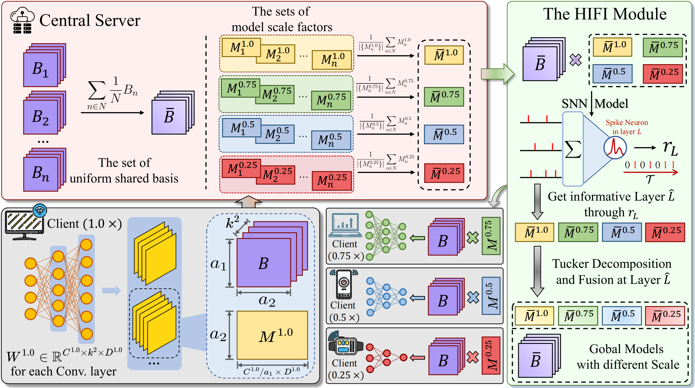

# SFedHIFI: Fire Rate-Based Heterogeneous Information Fusion for Spiking Federated Learning


Official PyTorch implementation of the AAAI 2026 paper:

**SFedHIFI: Fire Rate-Based Heterogeneous Information Fusion for Spiking Federated Learning**, [AAAI 2026](https://arxiv.org/abs/2603.14956) 

## Overview

Spiking Federated Learning (SFL) has attracted increasing attention due to the energy efficiency of Spiking Neural Networks (SNNs). However, most existing SFL methods assume homogeneous models and sufficient computational resources across clients, which limits their applicability in real-world heterogeneous environments.

To address this challenge, we propose SFedHIFI, a novel Spiking Federated Learning framework with Fire Rate-Based Heterogeneous Information Fusion. The framework enables heterogeneous clients to train SNNs with different model scales and supports cross-scale aggregation through channel-wise matrix decomposition and a heterogeneous information fusion module.

Extensive experiments on multiple benchmarks demonstrate that SFedHIFI effectively supports heterogeneous SFL and consistently outperforms baseline methods while achieving significant energy savings compared with ANN-based federated learning.

## Framework

The overall framework of **SFedHIFI** is illustrated below.



SFedHIFI enables heterogeneous clients to collaboratively train spiking neural networks with different model scales through fire rate-based information fusion and cross-scale aggregation.

## Installation
We recommend using **Python 3.9+** and **PyTorch 2.0+**.
### Clone repository
```bash
git clone https://github.com/rtao499/SFedHIFI.git
cd SFedHIFI
```

### Conda Environment (Recommended)
```bash
conda env create -f environment.yml
conda activate sfedhifi
```

### Pip Installation
Alternatively, install dependencies with pip:
```bash
pip install -r requirements.txt
```

## Dataset
The experiments in this project use public datasets:

* Fasion-Mnist
* CIFAR-10
* CIFAR-100

Please download the public datasets and place them in your local directory, e.g.: ``/path/to/dataset``.

Then set the hyperparameter `--dir_data` accordingly:
```
--dir_data /path/to/dataset
```

Dataset preprocessing and loading scripts are implemented in the [data](/data) directory.

## Training SFedHIFI

The script can be found under [demo.sh](demo.sh), below is an example of SFedHIFI on CIFAR-10 dataset with IID setting.

```bash
CUDA_VISIBLE_DEVICES=0 python main_FL.py --n_agents 10 --dir_data /home/user/dataset --data_train cifar10 --data_test cifar10 --n_joined 5 --model_type snn --tucker --tucker_epochs 225 --split iid --T 10 --local_epochs 2 --batch_size 32 --epochs 500 --decay step-250-375 --lr 0.1 --fraction_list 0.25,0.5,0.75,1 --template ResNet18 --model spiking_resnet_flanc --basis_fraction 0.125 --n_basis 0.25
```

## Baseline Methods

The script can be found under [demo.sh](demo.sh), below is an example of FedAVG on CIFAR-10 dataset with IID set.

```bash
CUDA_VISIBLE_DEVICES=0 python main_FL.py --n_agents 10 --dir_data /home/user/Dataset --classic fedavg --data_train cifar10 --data_test cifar10 --n_joined 5 --model_type snn --split iid --T 10 --local_epochs 2 --batch_size 32 --epochs 500 --decay step-250-375 --lr 0.1 --fraction_list 0.25,0.5,0.75,1 --template ResNet18 --model spiking_resnet_flanc --basis_fraction 0.125 --n_basis 0.25
```

## Logging (Optional)
This project optionally supports experiment logging with [SwanLab](https://github.com/SwanHubX/SwanLab). 

To enable logging, configure your API key in [main_FL.py](main_FL.py):
```
import swanlab
swanlab.login(api_key="YOUR_API_KEY")
```

## Acknowledgements & Contact Information
This project builds upon the following open-source projects:

* [Spikingjelly](https://github.com/fangwei123456/spikingjelly)
* [FLANC](https://github.com/HarukiYqM/All-In-One-Neural-Composition)

We sincerely thank the authors for making their code publicly available.

For help or issues using this git, please submit a GitHub issue.

For other communications related to this git, please contact [rantaostd@gmail.com](rantaostd@gmail.com).

## Citation

If you find this repo useful, please consider citing:

``````
@misc{tao2026sfedhifiratebasedheterogeneousinformation,
      title={SFedHIFI: Fire Rate-Based Heterogeneous Information Fusion for Spiking Federated Learning}, 
      author={Ran Tao and Qiugang Zhan and Shantian Yang and Xiurui Xie and Qi Tian and Guisong Liu},
      year={2026},
      eprint={2603.14956},
      archivePrefix={arXiv},
      primaryClass={cs.LG},
      url={https://arxiv.org/abs/2603.14956}, 
}
``````